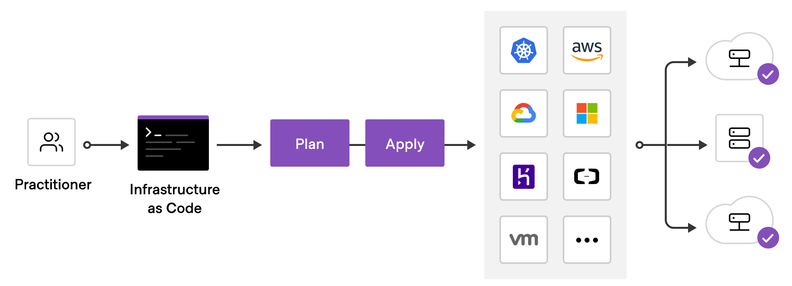

# Terraform-tutorial

 

## Published articles:

 - [Terraform Tutorial - Part 1 - Docker Introduction](./part01-docker-provider/)

 - [Terraform Tutorial - Part 2 - GitHub Introduction](./part02-github-provider/)

 - [Terraform Tutorial - Part 3 - Kubernetes Introduction](./part03-kubernetes-provider/) InProgress

 - [Terraform Tutorial - Part 4 - Gitlab Introduction](./part04-gitlab-provider/) InProgress

 - [Terraform Tutorial - Part 5 - HA proxy Introduction](./part05-HA-proxy-provider/)

 - [Terraform Tutorial - Part 6 - Grafana Introduction](./part06-grafana-provider/)

 - [Terraform Tutorial - Part 7 - Cisco DevNet Introduction](./part07-CiscoDevNet-provider/)

 - [Terraform Tutorial - Part 8 - Vsphere Introduction](./part08-vsphere-provider/)

 - [Terraform Tutorial - Part 9 - Helm Introduction](./part09-helm-provider/)

 - [Terraform Tutorial - Part 10 - Maas Introduction](./part10-maas-provider/)

 - [Terraform Tutorial - Part 11 - Consul Introduction]() InProgress

 - [Terraform Tutorial - Part 12 - Vault Introduction]() InProgress

 - [Terraform Tutorial - Part 13 - Keycloak Introduction]() InProgress

 - [Terraform Tutorial - Part 14 - Azure DevOps Introduction]() InProgress

 - [Terraform Tutorial - Part 15 - OpenStack Introduction](./part15-openstack-provider/)

## Contributions:

All contributions are welcomed. Help me to enrich this repository.

If you find any **bugs** in the examples, please file an issue.

### TODO:

 - [ ] Adding Terraform Vcenter

